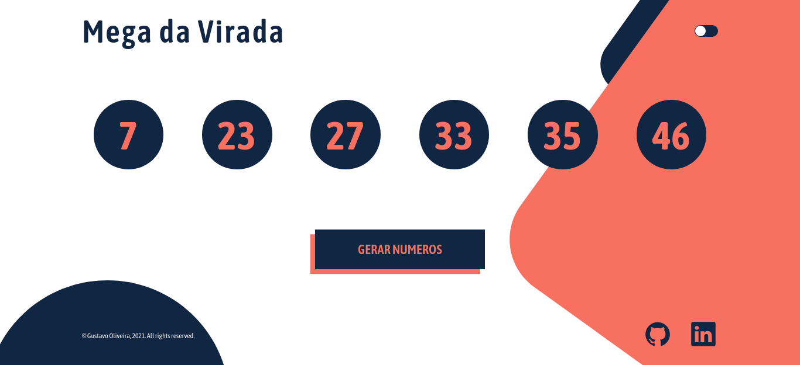
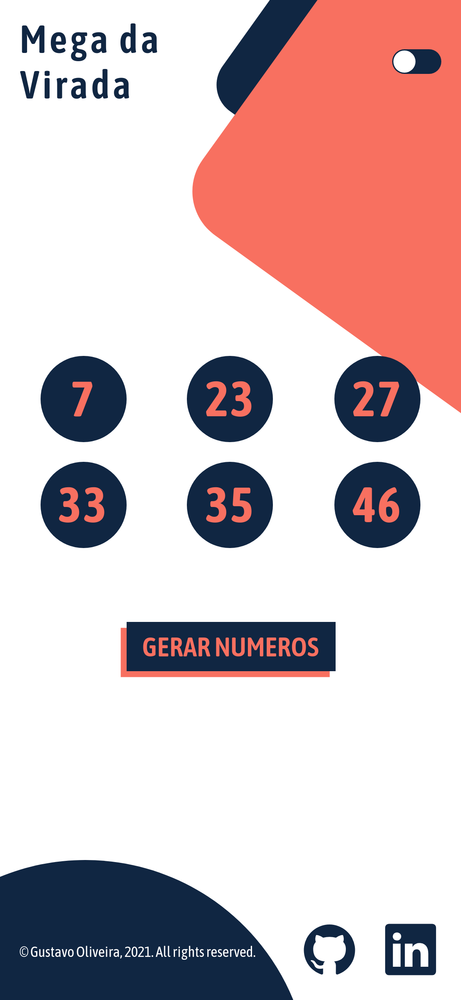

# Gerador aleatório de números

Página para assim como na mega sena gerar 6 números aletórios entre 1 e 60;

<table>
  <tr>
    <td>
       
      </td>
    <td>
      
    </td>
  </tr>
  <tr>
    <td>
       
      </td>
    <td>
      
    </td>
  </tr>
 </table>

## Lógica para gerar os números

- Ser número positivo
- Ser entre 1 e 60
- Os números não podem ser repetidos
- Devem ser exibidos na página em ordem crescente

## Ferramentas utilizadas

- [Nextjs](https://nextjs.org/)
- [Typescript](https://www.typescriptlang.org/)
- [Styled Components](https://styled-components.com/)
